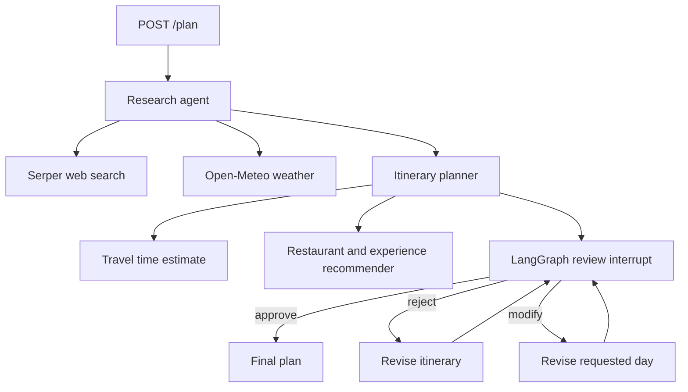

# AI Travel Planner

A browser-based travel planner and FastAPI service that research a destination, draft a day-by-day trip, and wait for a human decision before finalizing it. LangGraph drives the workflow and stores its checkpoints in SQLite, so review can resume after an application restart.

The app includes a browser UI for planning trips and a FastAPI interface for the backend workflow.

## Workflow



The agents use an LLM for structured research and itinerary drafting. Search results supply evidence; the planner tools add approximate travel time and sourced dining candidates. The reviewer has the final decision.

## Setup

The existing project folder on this Mac has a `.venv` environment. From that folder, run:

```bash
./start.sh
```

The app starts in demo mode without API keys.

The downloadable ZIP excludes `.venv`, `.env`, and local database files. After extracting it, use Python 3.11 or newer to install dependencies. The system `python3` on this Mac is 3.9, so use a newer Python command such as `python3.12`. From the extracted project directory:

```bash
python3.12 -m venv .venv
source .venv/bin/activate
pip install -r requirements.txt
cp .env.example .env
./start.sh
```

With `DEMO_MODE=auto`, the application starts in clearly labeled demo mode when either API key is missing. Demo mode uses sample activities and estimates, so the complete UI and human review flow work offline. To use live research and AI planning, set `OPENAI_API_KEY` and `SERPER_API_KEY` in `.env`; auto mode then switches to live. Set `DEMO_MODE=false` to require live mode, or `DEMO_MODE=true` to force a keyless demo. Open-Meteo needs no key. `LLM_MODEL` defaults to `gpt-4.1-mini`; change it to a model your account can use. For an OpenAI-compatible endpoint, set `LLM_PROVIDER=openai_compatible`, `LLM_BASE_URL`, `LLM_MODEL`, and `OPENAI_API_KEY` (the compatible provider's key).

The API docs are available in the running app when launched locally. The database files are created in `.data/`, or under `DATABASE_DIR` if set. The Dockerfile runs one worker because SQLite and the in-process background queue are intended for a single-process local deployment.

## API example

Create a plan (HTTP 202):

```bash
curl -X POST http://127.0.0.1:8000/plan \
  -H 'Content-Type: application/json' \
  -d '{"destination":"Paris","start_date":"2026-11-10","end_date":"2026-11-15","budget_min":1000,"budget_max":2000,"currency":"USD","interests":["art","food","history"],"travelers":2}'
```

Response:

```json
{"plan_id":"a-uuid","status":"researching"}
```

Poll `GET /plan/{plan_id}`. When `requires_review` is true, the response includes `research`, `draft_itinerary`, and `status: "awaiting_review"`. Review with one of:

```bash
curl -X POST http://127.0.0.1:8000/plan/PLAN_ID/review -H 'Content-Type: application/json' -d '{"action":"approve"}'
curl -X POST http://127.0.0.1:8000/plan/PLAN_ID/review -H 'Content-Type: application/json' -d '{"action":"reject","feedback":"Make Day 2 more relaxed."}'
curl -X POST http://127.0.0.1:8000/plan/PLAN_ID/review -H 'Content-Type: application/json' -d '{"action":"modify","modifications":{"day":3,"request":"Replace the museum with a food tour."}}'
```

Rejection and modification return another draft and pause for review again. Approval unlocks `GET /plan/{plan_id}/final`. Before approval, that endpoint returns HTTP 409. Unknown IDs return HTTP 404; invalid request bodies return HTTP 422. Background failures set the plan status to `failed` and expose a generic error while details stay in server logs.

## Persistence and design

`app/graph/workflow.py` defines the LangGraph route. `app/graph/nodes.py` calls `interrupt()` inside the review node and uses `Command(resume=...)` to continue. Each plan ID is also the checkpoint thread ID. `checkpoints.sqlite` stores execution state; `plans.sqlite` stores the API-facing index. Pending initial jobs and submitted review decisions are recovered on startup. Approval and revision require a saved review checkpoint. Review claims use a conditional SQLite update to prevent two simultaneous decisions for one draft.

`app/agents/llm.py` is the model interface. `app/tools/` contains provider interfaces and implementations, so Serper, Open-Meteo, travel time, and the recommender can be replaced separately. Travel time is an approximate local heuristic. Restaurant candidates come from live search results. Weather is labeled unavailable when dates fall outside the forecast window or the service cannot respond. All prices and travel times are estimates; verify bookings, availability, and safety details before travel.

## Tests

```bash
pip install -r requirements-dev.txt
pytest -q
```

Tests mock the model and external APIs while using real LangGraph execution and SQLite checkpoints. They cover request validation, tool behavior, external failures, approval, rejection, targeted modification, API errors, demo UI serving, keyless demo flow, and resume after constructing a new service instance.

## Production improvements

Move checkpoints and plan records to PostgreSQL, and initial jobs to a durable queue. Add authentication and per-user ownership, rate limits, retries with backoff, tracing, API cost limits, evaluation of research quality, and a real routing provider. SQLite and FastAPI background tasks keep this implementation easy to run locally; run the supplied Dockerfile with one worker.
